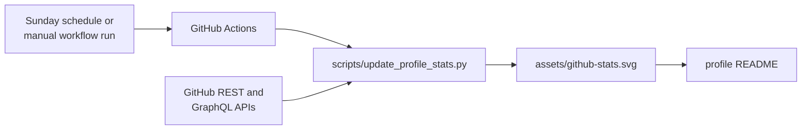

<p align="center">
  
</p>

<p align="center">
  <em>“From raw data, useful systems. From complex problems, clear decisions.”</em>
</p>

<p align="center">
  
</p>

<p align="center">
  
</p>

<details>
<summary><strong>Accessible text dossier</strong></summary>

I’m **Hrithik**, a data-focused builder working across analytics, software, and practical automation. I turn messy data and business questions into clear insights, useful dashboards, and maintainable software products. My path sits between **Data Analyst**, **Analytics Engineer**, and **Full-Stack Developer**.

- **WorkflowHQ:** Full-stack workflow platform built with React, Express, PostgreSQL, and REST APIs.
- **Breaking Games:** SQL and Python analysis across marketing, Shopify, product performance, and customer behaviour.
- **Engineering OS:** Living technical profile documenting projects, contribution activity, and technical growth.
- **Working principle:** Validate the data before trusting the conclusion.

</details>

<p align="center">
  
</p>

<p align="center">
  
</p>

<p align="center">
  <a href="https://github.com/Hrithik028"></a>
  <a href="https://www.linkedin.com/in/hrithik-jadhav-a08068199/"></a>
  <a href="mailto:hrithik.jadhav028@gmail.com"></a>
</p>

<p align="center">
  
</p>

<p align="center">
  
</p>

<p align="center">
  
</p>

<details>
<summary><strong>How the GitHub telemetry panel is maintained</strong></summary>



The workflow in `.github/workflows/update-profile-stats.yml` is scheduled for `21:17 UTC` each Sunday and also supports manual dispatch. It runs the standard-library Python script with GitHub's repository token, then commits only `assets/github-stats.svg` when that file changes.

Run the generator locally with Python 3:

```powershell
$env:GITHUB_TOKEN = "your_token"
python scripts/update_profile_stats.py
Remove-Item Env:GITHUB_TOKEN
```

`GH_TOKEN` is accepted as an alternative, and `PROFILE_USERNAME` can override the default `Hrithik028` account. Keep credentials in environment variables; never write a token into the repository.

The panel reports a point-in-time count of public repositories, contributions in GitHub's current contribution window, followers, following, and the four most common primary languages among up to 100 owner repositories. Counts can become stale between runs, and API availability, permissions, rate limits, workflow settings, or branch protection can prevent an update. The workflow configuration was reviewed locally; no claim is made here about its latest remote run.

</details>
