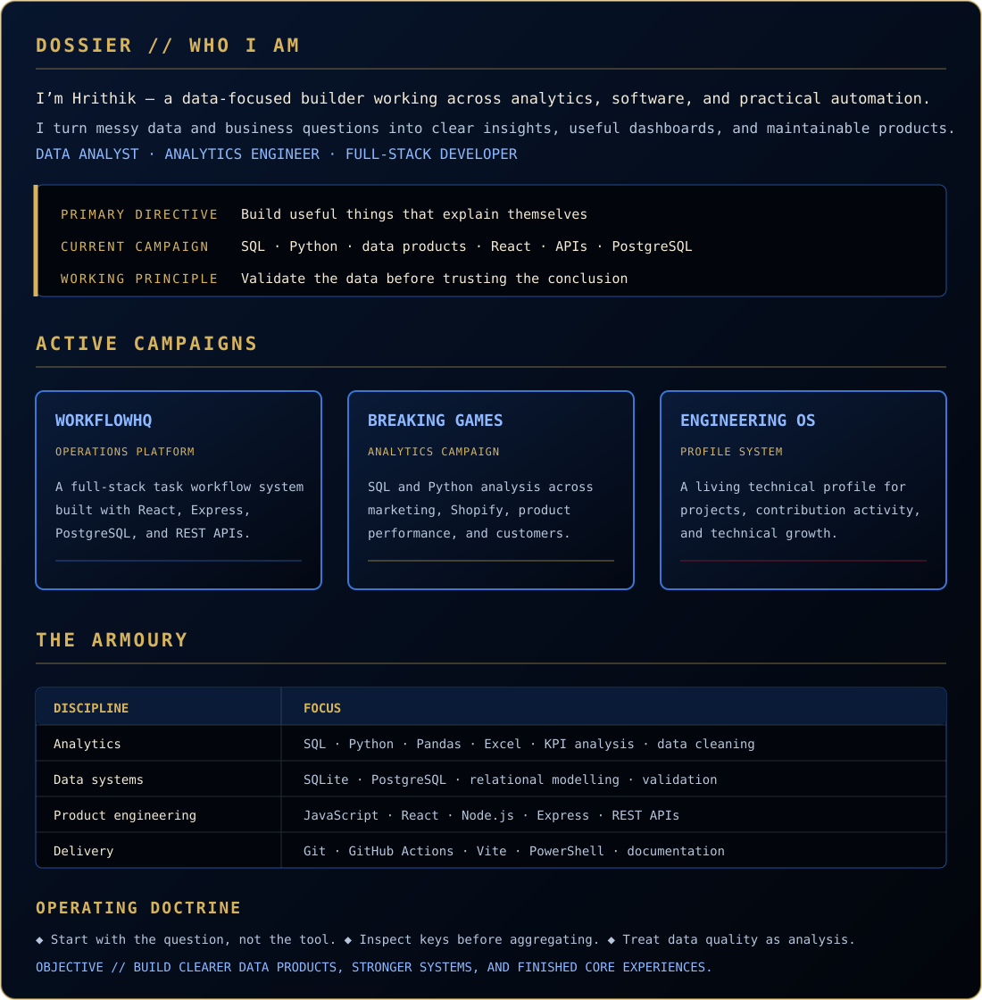
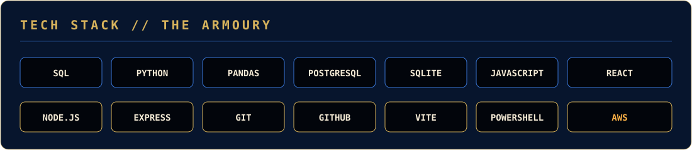
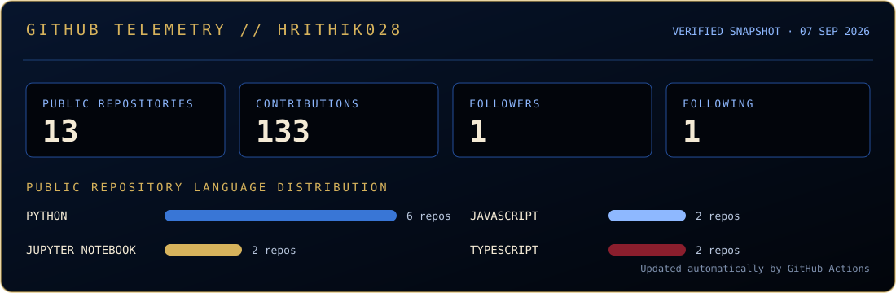

  

  <em>“From raw data, useful systems. From complex problems, clear decisions.”</em>

  

  

<strong>Accessible text dossier</strong>

I’m **Hrithik**, a data-focused builder working across analytics, software, and practical automation. I turn messy data and business questions into clear insights, useful dashboards, and maintainable software products. My path sits between **Data Analyst**, **Analytics Engineer**, and **Full-Stack Developer**.

- **WorkflowHQ:** Full-stack workflow platform built with React, Express, PostgreSQL, and REST APIs.
- **Breaking Games:** SQL and Python analysis across marketing, Shopify, product performance, and customer behaviour.
- **Engineering OS:** Living technical profile documenting projects, contribution activity, and technical growth.
- **Working principle:** Validate the data before trusting the conclusion.

  

  

  
  
  

  

  

> Snapshot generated from public GitHub data on **31 August 2026** and refreshed weekly by GitHub Actions. The profile and repository links above remain live.

---

  

